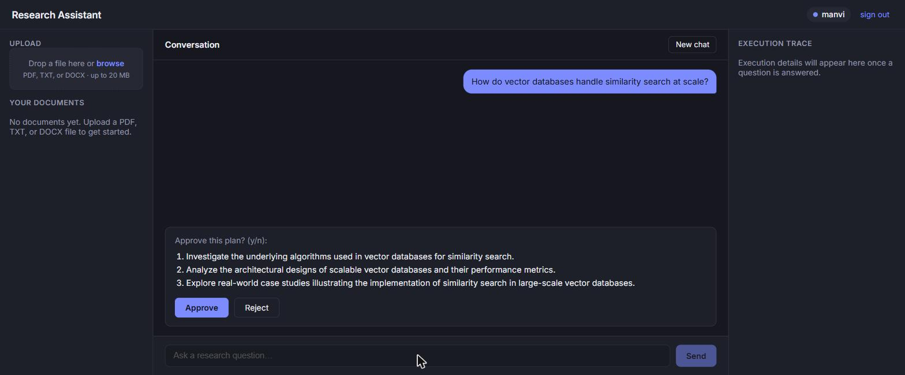
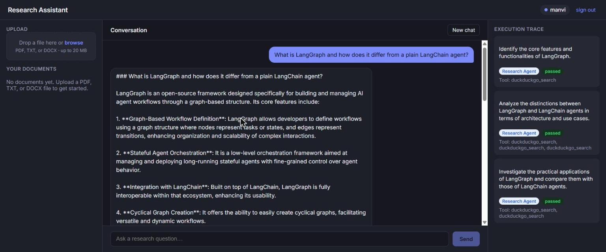
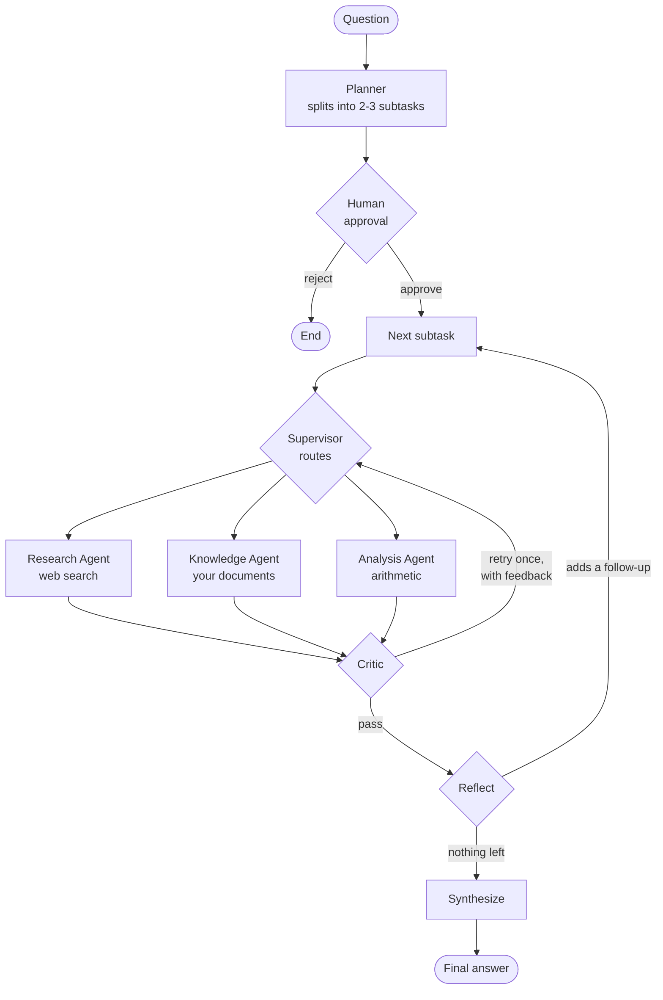

<div align="center">

# Personal Research Assistant

**A multi-agent research assistant built on LangGraph** — it plans your question into subtasks, waits for your approval, routes each one to a specialist agent, has a critic review the work, and follows up on what it finds.

[**Live demo →**](https://agentic-ai-theta-seven.vercel.app)




<sub>The graph plans, then <b>stops</b> — waiting on a human before any research runs.</sub>



<sub>Approved: each subtask shows which specialist handled it, which tool it called, and how the critic ruled.</sub>

</div>

> The demo runs on free tiers, so the first request after a quiet period takes
> 30–60 seconds while the backend wakes up.

## What makes it interesting

- **It asks before it acts.** The graph pauses mid-run with `interrupt()`, hands you the plan, and waits. Approve and it resumes exactly where it stopped — even across a backend restart, because every step is checkpointed to Postgres.
- **It routes to specialists, then checks their work.** A supervisor picks the right agent per subtask; a critic reviews the answer and can send one retry back with feedback attached.
- **It notices what it missed.** After the approved plan is done, the agent reflects on its findings and can add a follow-up subtask — but it can only *add* work. When the loop stops is decided by a plain function, not the model.
- **It reads your documents, and only yours.** Uploads are chunked, embedded, and searched with pgvector, scoped by user at every query.
- **It shows its work.** The trace panel reports which specialist handled each subtask, which tool it called, and how the critic ruled.

## How it works



Each specialist is a compiled subgraph with exactly one tool:

| Specialist | Tool | Answers from |
|---|---|---|
| Research Agent | `search_web` | DuckDuckGo |
| Knowledge Agent | `search_uploaded_documents` | your uploads, via pgvector similarity search |
| Analysis Agent | `calculate` | AST-based arithmetic — no `eval` |

The executor is a bounded ReAct loop. `reflect()` may append follow-up subtasks it discovers it needs, but termination is `decide_next_action()` — a pure function capped at `MAX_REACT_STEPS`. An agent that picks its own exit condition can't be reasoned about; this one always halts.

## Stack

```
React + TypeScript  ──HTTP──▶  FastAPI  ──▶  LangGraph  ──▶  Postgres + pgvector
frontend/                      app/api/      app/graphs/     checkpoints · documents · chunks
```

`app/` is a production-style package — async connection pool, bearer-token auth, per-route rate limiting, prompt-injection guards on retrieved text, and startup validation that refuses to boot a misconfigured process rather than failing one request at a time.

## Quickstart

**1. Database** — Postgres with `pgvector`, on port 5433:

```bash
docker compose up -d
```

**2. Backend:**

```bash
# Windows
.venv\Scripts\activate
# macOS / Linux
source .venv/bin/activate

pip install -r requirements.txt
uvicorn app.main:app --port 8000
```

`OPENAI_API_KEY` in a root `.env` is the only variable you must set locally.

**3. Frontend:**

```bash
cd frontend
npm install
npm run dev
```

Sign in with any name — it's what separates your documents and conversations from anyone else's. Upload a PDF, ask a question about it, approve the plan, and watch the trace fill in.

## API

Every user-scoped route takes its `user_id` from the bearer token, never from the request body.

| Method | Path | Auth | Purpose |
|---|---|---|---|
| `GET` | `/health` | — | Liveness plus a database round-trip |
| `POST` | `/auth/token` | — | Obtain a bearer token for a name; checks the access phrase only if one is configured |
| `POST` | `/chat` | bearer | Ask a question; returns the plan, pending approval |
| `POST` | `/approve` | bearer | Resume the paused graph and run the research |
| `POST` | `/reject` | bearer | Discard the plan without researching |
| `GET` | `/documents` | bearer | List the caller's uploaded documents |
| `POST` | `/documents/upload` | bearer | Validate, extract, chunk, embed, and store a PDF/TXT/DOCX |
| `POST` | `/documents/search` | bearer | Similarity search over the caller's own chunks |
| `POST` | `/documents/backfill-embeddings` | admin | Maintenance: embed chunks written before embeddings existed |

Interactive docs at `/docs` once the backend is running.

## Tests

```bash
pytest tests/                                    # everything (calls the real API, costs money)
pytest tests/ --ignore=tests/test_app_backend.py # network-free unit tests
cd frontend && npm test                          # vitest
```

Only `test_app_backend.py` touches the network — it's gated behind a fixture that skips when `OPENAI_API_KEY` is absent. Everything else is deterministic.

<details>
<summary><b>Configuration</b></summary>

| Variable | Default | Purpose |
|---|---|---|
| `OPENAI_API_KEY` | — | Required. Chat + embedding calls |
| `DATABASE_URL` | local Docker Compose | Postgres connection string |
| `ENVIRONMENT` | `dev` | `prod` enforces the startup checks below |
| `ALLOWED_ORIGINS` | *(empty)* | CORS allow-list. In `dev` the Vite origin is added automatically; in `prod` this is the whole list |
| `AUTH_SECRET_KEY` | *(ephemeral)* | HMAC signing key for tokens |
| `AUTH_SIGNUP_SECRET` | *(unset — sign-in is open)* | Shared access phrase, if you want one |
| `AUTH_ADMIN_SECRET` | *(unset)* | Separate secret for the backfill route only |
| `OPENAI_CHAT_MODEL` / `OPENAI_EMBEDDING_MODEL` | `gpt-4o-mini` / `text-embedding-3-small` | Models |
| `LLM_REQUEST_TIMEOUT_SECONDS` / `LLM_MAX_RETRIES` | `60` / `2` | Per-call timeout and retries |
| `DB_POOL_MAX_SIZE` | `10` | Connection pool ceiling |

With `ENVIRONMENT=prod`, `validate_for_startup()` refuses to boot on a fallback `DATABASE_URL`, `sslmode=disable`, a missing signing key or signup secret, or an empty origin list — reporting *every* problem at once, so a misconfigured deployment is fixed in one restart rather than rediscovered one at a time.

Deployment (Neon + Render + Vercel) is documented in [`DEPLOYMENT.md`](DEPLOYMENT.md).

</details>

<details>
<summary><b>Known limitations</b> — stated plainly rather than left to be discovered</summary>

- **The demo has no real identity.** It runs with no `AUTH_SIGNUP_SECRET`, so anyone can obtain a token for any name and read that name's uploads. Setting the secret restores a shared-phrase gate — still not an identity provider, since anyone holding the phrase can mint a token for any `user_id`. Real accounts would need a user table, password handling, and revocation.
- **No streaming.** `/chat` and `/approve` are single blocking calls, so the trace panel fills in once at the end rather than live.
- **Rate limiting is in-process.** A sliding window in a dict, not Redis — it resets on restart and doesn't coordinate across replicas.
- **Subtasks run sequentially**, one per ReAct step, even when independent.
- `search_web` results aren't wrapped in the untrusted-content envelope that guards retrieved documents — a known, deliberate gap.

</details>

<details>
<summary><b>The 25-stage learning archive</b> — how this was built, one concept at a time</summary>

Each folder in `stages/` is self-contained and runnable on its own, so any stage can be diffed against the next to see exactly what was added. They're kept frozen; `app/` is the production port of Stage 25 and has since evolved past it.

```bash
python stages/stage1_chatbot/main.py
```

| Stage | Folder | New concept |
|---|---|---|
| 1 | `stage1_chatbot/` | `StateGraph`, nodes/edges, checkpointer memory |
| 2 | `stage2_tool_agent/` | Tool calling, the ReAct loop |
| 3 | `stage3_rag/` | Chunking, embeddings, vector store, retrieval |
| 4 | `stage4_web_fetch/` | A tool with a real HTTP side effect |
| 5 | `stage5_pdf_fetch/` | Binary content, PDF extraction |
| 6 | `stage6_planner/` | Custom state schema, hand-written conditional-edge loop |
| 7 | `stage7_human_in_loop/` | `interrupt()` / `Command(resume=…)` |
| 8 | `stage8_research_workflow/` | Composing a compiled graph inside another node |
| 9 | `stage9_simple_memory/` | Long-term memory vs. per-thread graph state |
| 10 | `stage10_multi_tool_agent/` | Tool selection in isolation |
| 11 | `stage11_research_agent/` | Specialization vs. a generalist |
| 12 | `stage12_two_specialist_agents/` | Two specialists, zero shared state |
| 13 | `stage13_supervisor/` | Structured output + conditional edge on a routing field |
| 14 | `stage14_critic/` | A review node, and routing backward for one bounded retry |
| 15 | `stage15_analysis_agent/` | A "compute" specialist rather than a "retrieve" one |
| 16 | `stage16_three_specialist_supervisor/` | Widening a routing `Literal` from two choices to N |
| 17 | `stage17_final_multi_agent_system/` | The capstone: composing two independently-built graphs |
| 18 | `stage18_postgres_persistence/` | Durable checkpointing across process restarts |
| 19 | `stage19_fastapi_backend/` | `interrupt()`/resume spanning two HTTP requests |
| 20 | `stage20_document_upload/` | First hand-written (non-checkpointer) Postgres tables |
| 21 | `stage21_semantic_search/` | `pgvector`, and the repo's first schema *evolution* |
| 22 | `stage22_knowledge_agent_rag/` | Swapping a specialist's tool with nothing above it changing |
| 23 | `stage23_user_document_isolation/` | `InjectedState` — a tool argument the model can't see or set |
| 24 | `stage24_security_guardrails/` | Untrusted content needs framing, not filtering |
| 25 | `stage25_react_ui/` | A full frontend for two additive response shapes |

Every folder has its own `README.md` with the full breakdown; `docs/PROGRESS.md` is the running log.

Folder numbers drifted from the original roadmap: the web-fetch and PDF-fetch tools (4–5) were built ahead of planning, so planning landed at 6 and human-in-the-loop at 7. The roadmap closed at Stage 17; stages 18–25 are deliberate extensions past it, each adding one production concern.

</details>
